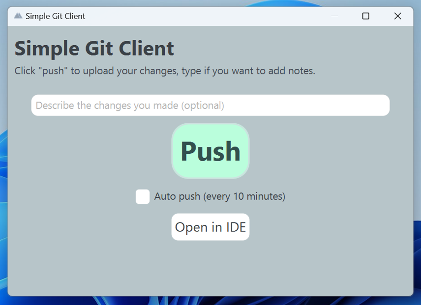

# SimpleGitClient

A super-simple Git client for GitHub users. ***Best for high-school students.***

Pre-release 1 now available for Windows 64-bit machines, soon coming to Linux and macOS (and maybe Windows 32-bit machines).

---

## Requirements
- A windows 64-bit machine.
- A github account and a [Personal Access Token](https://docs.github.com/en/authentication/keeping-your-account-and-data-secure/creating-a-personal-access-token) with "repo" scope.
- A USB flash-drive is nice but not required. It's used to save and retrive the Github PAT for a more seamless experiance.

## Made for students
Right now, high-school students who study Computer Sciense and Software Development need to save their projects on an external drive in order to continue them at home and do homework. I hope you already see why this way is problematic: some students forget their drives at home (or at school), some are facing problems because external drives are not 100% supported in all of the IDEs (trust me), some just don't know how to use flash drives (yes, third year Software Development students, I know...).

Of course there's this great solution we all use called GitHub, but apparently teachers don't want to teach how to use it (and, well, imagine one who doesn't know how to use a USB flash-drive clones, fetches, pulls, commits and pushes a repository on a daily basis); Some students use Google Drive - but in order to use it they need to zip the projects and later unzip, and then zip again, and then, well, you undersatnd. We needed a better solution - one that's instant USB flash drives, easy to use like Google Drive and purpose-focused like github, and SimpleGitClient (I really need to find a better name) is the solution.

SimpleGitClient is a simplified GitHub app. "but how much can you simplify GitHub?" -well, the main screen of the app has only 3 buttons: a Push button, an Auto-Push button (pushes automatically every 10 minutes), and an "Open in IDE" button (I think it would help).

To connect to GitHub, students would need to type their PATs once - and it'll be saved on their flash-drives for future uses (If they forget to bring a flash-drive - they can just make a new PAT).

***SimpleGitClient is a password-free, ZIP free, [copy, paste, delete, build, clean, reload, move, delete again, reboot, change configuration, reset, jump-out-of-the-window]-free , and a(n almost) problem-free solution for saving files!***

## Limitaions and Problems (I'll be fixing them)
- currently, you can only clone, but cannot fetch and pull from origin. That means you need to delete the project's folder every time you start the program (it's done automatically but still not so nice and can cause problems in the future).

## Can I help?
Of course! Right now I'm looking for testers (high-school students and teachers are preferred), so feel free to test the app, recommend to your teachrs (or students, or friends), and open an issue or start a discussion. Thank you!